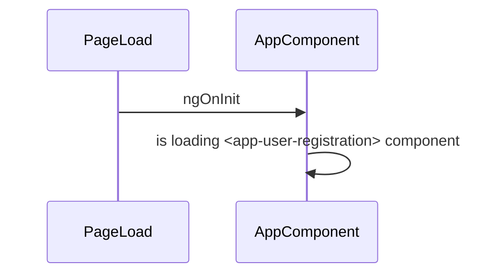
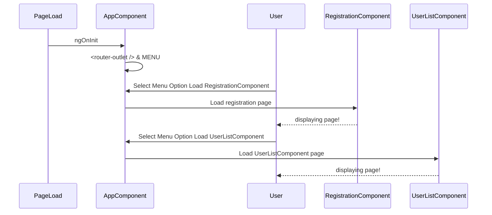
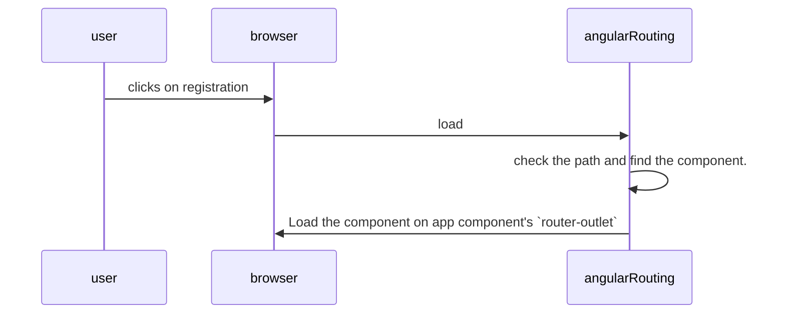
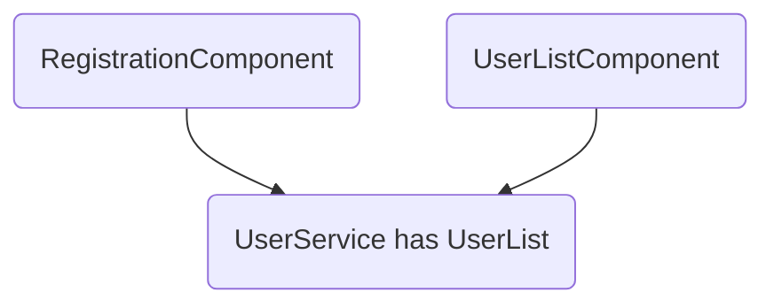

# Introduction To Angular

View the live app in [GitHub Pages here](http://www.rupeshtiwari.com/coding-example-angular-introduction/).
This project is only Client Side Application in our next course we will make this application full stack by adding server side to this app.

- We are covering below specs from Angular:
  - component
  - component communication
  - Angular Component LifeCycle Events
    - onNgInit
  - directive
  - angular cli
  - routing
  - services
  - lazy loading module
  - parent child module communication
  - angular material

**Course Highlits**

- How to Create Angular Application
- What are Angular CLI commands
- What are the folders & Files within Angular app what are their purpose & responsibilities.
- What are the scripts available on Angular app `npm start` `npm run build`
- Create angular app and render list of string
- What is Component & Directive: Basic Introduction
- Create a Tod list Component
- How to bind HTML Form Controls on Angular Component
- How to create Multiple Components in a single Angular app
- How to use Angular Routing to navigate between components
- How to Communicate between sibling components by passing some data
- How to use Query prams using Angular Routing
- How to create Angular Directive & Demo
- What is Lazy Loading of Module
- Create New angular feature module and User lazily in Angular App.
- What is Angular Material
- Integrate Angular Material in our Angular App
- Deployment to production

https://docs.google.com/document/d/1s7uXlFbcJSSzVMWQ9YFmHM3FmHxdlyxF3WDBExBk0zs/edit?usp=sharing

## Module: Introduction

- I will teach the basic example
- Then I can ask to do some complex example
- You will do some part of it. It depends. that is fine you did something or not
- Then I will give you the solution
- However, you should never give up once I show the demonstration.
- And I will teach you new chapter and give you new assignment.
- You go home and finish your previous assignment which you had done partially and refer my solution as reference.
- First finish you previous assignment then go and start doing the new assignment.
- Unless you do by your own till you are not learning and you are not getting any benefit out of this course.
- You have to be serious, believe on yourself and march on.
- I am always there to guide and pull you up.
- Create one repository in Github and for each assignment create one branch and work on branch only.
- Finally you can merge your working branch in master branch.

### What skills do you need for angular ?

- Basics of npm 👍
- JavaScript👍
- Typescript👍
- HTML👍
- CSS👍
- RxJS 👍
- Little bit of webpack - (not that much required.)

### What is angular?

Angular is a platform
Because it has libraries and framework built in Angular.

Example:
Angular Core
Testing Framework
Routing Library (module)
Page1(product list) → Page2(product)
Form Validation
Inbuilt library

Django page to page linking the same thing is called routing.

### Why is angular a node application?

see angular is node application. Why it is a node application because it is created, and built by angular CLI. and angular cli uses node to create your app and build your app and serve your app too! Therefore angular is a node application.

Similarly if you are writing a node application and you want to know which are the libraries that my node application depends on?

There should be a file which should have all the list of dependencies. It is the package.json dependencies property which holds all of the dependencies for this app.

And all these dependencies will be bundled in a single file called as vendor.js

### Developer writes the test, then do we need a tester?

Yes we still need a testing team. They do explorative & End to end testing.

Why did the developer write the test?
Code refractory
Evolve design
We Mock API and test.

### Angular CLI

- what is angular cli?
- What is the 3rd party library?
  Any library that you don't own and you take from an outside world example jQuery library we use for navigating and manipulating dom. And our company did write the jQuery library therefore it is called as 3rd party. In angular we put all 3rd party libraries in the vendor bundle. So if you open todo app open and F12 check html
  If you see there is a vendor.js file in script tag. That bundle has all of the 3rd party libraries included in that.

- Array functions?
  Filter, map , join

- What is a webpack? Is it a file or compiler ?
  Webpack is a library who converts TS to JS.

### What is RxJS?

It is written in pure javascript. It adds behavior on data and makes it reactive functions.

`Observables` are `lazy` they done run unless we `subscribe` them.

**What is reactive?**
When you don’t continuously check the status of any work so you are lazy and you wait once that job is done to be notified so you are reactive.

Example in your calendar if you have any event. Event is a data example, a friend's birthday is data. Once you feed your data from the keyboard then calendar makes that data available to you on that day in future. If you try to compare the birthdate that you write in your diary vs calendar. What is the difference u find.

In diary u have to be eager and continuously check whether birthday is today or not. It has no behavior, it is dummy. Data and it is lying in your diary.

In other examples calendar added some behavior on the birthday date such that on that day the birthday was notified to you.
RxJS does the same thing it converts everydata into reactive by adding behavior on them such that it notifies you in the future time.

So the birthdate data got some behavior such that it made u lazy and reactive. In this example you can call that it is reactive data.

those are reactive examples you don't do anything and automatically it prompts you.

The opposite is proactive where you are being eager and keep checking the status of the job.

---

## Module: Introduction to Angular Folder & Files

When you create app then lets learn what are the folders and files are created.

### Module: Learning Checkpoint

- Package.json
- Config files
  - tslint
  - tsconfig
  - karma
  - angular.json
  - editor config
  - git ignore
- Source Code

  - src folder
    - app
    - assets
    - environments
    - favicon
    - index.html
    - main
    - polyfills
    - styles
    - test

- What is package.json
  How do you know that which JS libraries your project depends upon. If you create a JS HTML app then how do you know which are dependent libraries? Where you will try to find in your html. You will see in the script.
- **Scripts** of `package.json`\*\*
  - All the node scripts or cli to run build and test app.
    - serve, build, test, lint, end2end test,
- **DEV Dependency of `package.json`**
  When we do below operations through certain libraries. Those libraries node version and its name goes in `devdependencies` of package.json
  - Build
  - Compile
  - Test
  - Linting
  - Types
  - Reporting
    Because they are used only for development and testing.
- **Dependency of `package.json`**
  When you use libraries which are used to run your app those are going in dependencies of `package.json`
  - Angular
  - Tslib
  - Zone.js
  - Bootstrap
  - jQuery
  - RxJS


### Module: Demonstrate

How do you create app
`ng new introduction-to-angular`

- Create new App

### Assignment-1

- Run scripts inside package.json
- Dont afraid of runing scripts.

### Requirement

- Run below scripts

  - Start,
  - build,
  - test

### Learning Checkpoint

- How application is shown to us. What should I do for that?
- What happens when I do build?
- What happens when I run test?

## Module: Running Scripts on Angular project

### Module: Learning Checklist

- What happens when I run build
  - it creates `dist` folder
- What happens when I run start
  - it builds project
  - shows percentage
  - it loads files on dist folder?
  - no it loads files in memory
- What happens when I run test?
  - It build project in memory
  - it opens chrome and shows the test output.
- Except `npm test` & `npm start` you have to type `npm run`
  to run the script. example to run build script
  `npm run build`
- What is inside dist folder after running `npm run build` ?
  There are 7 distinct files
  - Runtime.js
    All Typescript files that you have in your project are already compiled in JS before it renders in your browsers? Who is compiling your typescript files? It is a webpack! Webpack converts your TS into JS. When it does convert that then it stores the run time instructions to resolve module or dependencies into the runtime.js file.
    Webpack instruction functions which are responsible to resolve all of the javascript object dependencies and module resolutions are present.
  - Pollyfills.js
    Browser missing functionality related to ES6 those functionality will be added to your browser.
  - Styles.js
    It is adding all of css into the DOM
  - Vendor.js
    Angular framework code also, rxJs, jQuery, bootstrap that you see in your npm package dependencies will go in vendor.js
  - Main.js
    If you search createTodo function delteTodo function you will get it in the main file. So what does it mean ? All of the application code that you write will be be put in main.js bundle file
  - Favicon
  - Index.html
- What is map files?
  Map files will create for those files which are written in typescript to help you to debug on browser.
  When you debug at that time even though JS is loaded on the browser.
  However when debug in chrome browser by F12 go to source then see typescript files.
  How it happened? Actually JS file is running still u see typescript file.
  Because of the map files.

- What is ES5 vs ES2015 ?
  **ES2015** is also known as ES6.
  It is a huge leap forward from ES5. It adds a tremendous amount of functionality to JavaScript.
  These features address some of the issues that made ES5 programming challenging. Inbuild Module support is good feature.
  **ES5** all modern browsers support it - main-es5 - size: 33kB - main-es2015 - size: 30KB - polyfill-es5 - size: 656kB - polyfill-es2015 - size: 142KB ( drastically small if you use browser where ES6 is supported your app will run faster. example chrome browser)
- Now we know ES2015 files are smaller and you want to load on the browser who support ES2015
  How would you load ES2015 on those browsers ? Do you have to do something for that?
  Angular is creating the es5 and es2015 for you. It is also creating index.html file.
  ```html
  <script src="runtime-es2015.js" type="module"></script>
  <script src="runtime-es5.js" nomodule defer></script>
  ```
  it will `type=module` for es6 files and Browser who supports ES6 they will only load the es2015 related JS files.


In order to prove that just load your app again and check then network tab in chrome.
Notice which files it is pulling? Answer is only es2015.
This is the magic.


In IE and IE edge


- How to serve files from dist. folder?
  open powershell form dist. folder and run
  `npx http-server -o`

## Module: Create Todo Component

show todo component how to create

**What is component?**
What is the component?
It combines the html and js together.
It scans the DOM to find out the selector.
And appends the HTML with behavior into the selector present in the html.
If you apply style in component it will only show in component.

It has html fragment.
It doesn't have `body` tag only div or paragraph or html.
Example:

```ts
@Component ({
selector:'app-todo'
templateUrl:'todo.html'
})
```

**todo.html**

```html
<h1>Todo works!</h1>
```

It will search the DOM to find the <app-todo> element and it will append our component html into the <app-todo> element.
Index.html file

```html
<body>
  <app-todo> </app-todo>
</body>
```

Run angular app then you see:

Index.html file

```html
<body>
  <app-todo>
    <h1>todo works !</h1>
  </app-todo>
</body>
```

In Angular: How JS and HTML code are linked to each other. In the HTML file you won't see we are referencing Javascript file linked. How is it working with the js files ?
Who is doing that?

Answer @Component decorator takes Html file name. Template url ? Why do you think we have given that? Angular framework will link your html with Javascript.

If you do not have @Component decorator then who will link your html to the JS and add the new DOM into the selector that you have made.

### Lesson-1: Create Todo List in App component

- App component put todo list html
- Add Todo method

### Assignment-2

- Add delete button on todo item

### Requirement

- Show Delete button

### Learning Checkpoint

- How to add click event handler
- How to filter array

## Lesson-2 Show Delete Button & Demo how it works

### Demonstrate

- Create delete button and do behavior
- Build the app and demo

## Lesson-3 Create Todolist Component

### Requirement

- Create brand new component called as `todolist`
- Add and delete todo buttons
- user todolist component on App component.

## Module: Registration Form

### Assignment-3 ( Create User Registration Form )

- Create Registration Form

### Requirement

- Create new component called as `userRegistration`
- No CSS No Validations
- Firstname
- Lastname
- Age (number)
- Gender (radio M, F at a time one should be selected )
- Email
- Password (should be hashed)
- Date of Birth (calendar)
- Time of Birth (birth)
- Country of Birth (dropdown)
- State of Birth (dropdown)
- Academic Report ( check box of (10th, 12th , Grad,) )
- Button ( submit )
- On submit show the user in the table

**Only Show the Academylist**

### Learning Checkpoint

- How to create new component & Use it in App Component.
  
  
  

- How can I use each Form Element in Angular?
- How can I bind the data to the each Form Element in Angular?
- After finishing this assignment You should be able to show any form element in angular app
- How to create new component

### Demonstrate

### Binding Form Controls Data in Angular

- Build the app and demonstrate
- Create component
- Run script `ng g c user-registration`
- Add `<app-user-registration></app-user-registration>` in `app.component.html`
- run `npm start`

- We will use `ngModel` therefore, we will import `@angular/forms` module
- `import {FormsModule} from '@angular/forms';`

```ts
import { BrowserModule } from "@angular/platform-browser";
import { NgModule } from "@angular/core";
import { FormsModule } from "@angular/forms";

import { AppRoutingModule } from "./app-routing.module";
import { AppComponent } from "./app.component";
import { UserRegistrationComponent } from "./user-registration/user-registration.component";

@NgModule({
  declarations: [AppComponent, UserRegistrationComponent],
  imports: [BrowserModule, AppRoutingModule, FormsModule],
  providers: [],
  bootstrap: [AppComponent],
})
export class AppModule {}
```

- Goto `src\app\user-registration\user-registration.component.ts`

```ts
import { Component } from "@angular/core";

export interface User {
  firstName: string;
  lastName: string;
  age: number;
  gender: string;
  email: string;
  password: string;
  country: string;
  state: string;
  city: string;
  dob: number;
  academic: string;
}
@Component({
  selector: "app-user-registration",
  templateUrl: "./user-registration.component.html",
  styleUrls: ["./user-registration.component.css"],
})
export class UserRegistrationComponent {
  user: User;
  userList: User[];

  constructor() {
    this.user = {
      firstName: "",
      lastName: "",
      age: 0,
      gender: "",
      email: "",
      password: "",
      country: "",
      state: "",
      city: "",
      dob: 0,
      academic: "",
    };
    this.userList = [];
  }

  register() {}
}
```

When the class will initialize then we will initialize user object.
So that it will bind these data in the html.

`userList` is an array. By default when you load your app then you want your userlist to be empty. It should have no users.
Therefore on load we are doing empty array.

- go to `src\app\user-registration\user-registration.component.html`

```html
<h1>My Registeration App</h1>
<form>
  <div class="form-group">
    <label> First Name : </label>
    <input placeholder="Enter here" [(ngModel)]="user.firstName" type="text" />
    <label> Last Name : </label>
    <input placeholder="Enter here" [(ngModel)]="user.lastName" />
  </div>
  <br />

  <div class="form-group">
    <label> Age :</label>
    <input placeholder="Enter here" [(ngModel)]="user.age" />
  </div>
  <br />

  <div class="form-group">
    <label> Gender :</label>
    <input type="radio" value="male" [(ngModel)]="user.gender" />Male
    <input type="radio" value="female" [(ngModel)]="user.gender" />Female
  </div>
  <br />

  <div class="form-group">
    <label> Email-ID :</label>
    <input type="email" placeholder="Enter here" [(ngModel)]="user.email" />
  </div>
  <br />

  <div class="form-group">
    <label> Password :</label>
    <input
      type="password"
      placeholder="Enter here"
      [(ngModel)]="user.password"
    />
  </div>
  <br />

  <div class="form-group">
    <label> Date Of Birth :</label>
    <input type="datetime-local" [(ngModel)]="user.dob" />
  </div>
  <br />

  <div class="form-group">
    <label> Academic Report :</label>
    <input type="checkbox" value="10" [(ngModel)]="user.academic" /> 10th
    <input type="checkbox" value="12" [(ngModel)]="user.academic" /> 12th
    <input type="checkbox" value="graduate" [(ngModel)]="user.academic" />
    Graduation
  </div>
  <br />

  <div class="form-group">
    Country :
    <select>
      <option></option>
      <option value="india">India</option>
      <option value="usa">USA</option>
      <option value="canada">Canada</option>
    </select>
    State :
    <select>
      <option></option>
      <option value="hyd">Hyderabad</option>
      <option value="pune">Pune</option>
      <option value="delhi">Delhi</option>
    </select>
    City :
    <select>
      <option></option>
      <option value="kphb">KPHB</option>
      <option value="vadgaon">Vadgaon</option>
      <option value="noida">Noida</option>
    </select>
  </div>
  <br />

  <button (click)="register()">Register</button>
</form>

<table border="2px" style="border-collapse: collapse;">
  <thead>
    <tr>
      <th>First Name</th>
      <th>Last Name</th>
      <th>Age</th>
    </tr>
  </thead>
  <tbody>
    <tr>
      <td></td>
      <td></td>
      <td></td>
    </tr>
  </tbody>
</table>
```

- Lets run the app
- update the script  
  `"start": "ng serve -o",`
- `npm start`

* **To Load User DATA from Server into HTML**
  We are pulling or showing an existing user data in ui.
  Lest only focus on academy list

  - Remove all hardcoded html data.
  - Define all data in component and load in html
  - AcademyList it an array of academy object.
  - `ademyList: { name: string; id: string; selected: boolean }[];`
  - User must be pointing to some one academy object.
  - Whichever option is selected by user that option we will mark as selected true.
  - lets show academy list in ui.
  - We loaded the check box option from data.
  - Now we have to select the checkbox as per user data.

  Final Code 👍

  ```ts
  import { Component } from "@angular/core";
  export interface User {
    firstName: string;
    lastName: string;
    age: number;
    gender: string;
    email: string;
    password: string;
    country: string;
    state: string;
    city: string;
    dob: Date;
    timeOfBirth: string;
    academyList: string[];
  }
  export interface Academy {
    name: string;
    id: string;
    selected: boolean;
  }
  @Component({
    selector: "app-user-registration",
    templateUrl: "./user-registration.component.html",
    styleUrls: ["./user-registration.component.css"],
  })
  export class UserRegistrationComponent {
    user: User;
    userList: User[];
    academyList: Academy[] = []; // define as array of academy and initialize with empty array.
    constructor() {
      // the selected user data
      this.user = {
        firstName: "Deepesh",
        lastName: "Soni",
        age: 30,
        gender: "Male",
        email: "deepesh@gmail.com",
        password: "xyz",
        country: "india",
        state: "cg",
        city: "bhilai",
        dob: new Date("23/07/1989"),
        academyList: ["1", "2"],
        timeOfBirth: "5 PM",
      };
      // academy
      this.academyList.push(
        {
          name: "10th",
          selected: false,
          id: "1",
        },
        {
          name: "12th",
          selected: false,
          id: "2",
        },
        {
          name: "Graduade",
          selected: false,
          id: "3",
        },
        {
          name: "PG",
          selected: false,
          id: "4",
        }
      );
      this.userList = [];
    }
    /**
  
  - While rendering each checkbox we will call this function
  - and this function will check if the academy id belongs to user or not.
  - @param academyId academy of raw data.
    */
    isSelected(academyId: string) {
      return this.user.academyList.indexOf(academyId) > -1;
    }
    register() {}
  }
  ```

  

### Next Assignment-4 ( New User Registration Form)

#### Requirement

It is a new user registration form and populate the user object from the Page only.
Bind only RAW Data coming from Server to UI
And take the entered data on page and put in USER object

- New user registration form
- No need to load data from User object
- Only load data from server for the Country , State, City list
- Save Below ID on USER object
  - Save StateId on State Selection
  - Save City Id on city selection
  - Save Country id on country selection

**Hints**

- How to show dropdown in angular app
- How to have relationship among dropdownlist
- How to filter StateDropdownList based on country
- How to filter City DropList based on State
- Save the cityid on User once selected by user

#### Learning Checklist

- `onInit` method from angular life cycle
- Public vs Private methods.
- Dropdown binding

**Step1: How to show dropdown in angular app**

- Lets learn how can we show drop down in Angular app
  Github checkin: https://github.com/rupeshtiwari/course-introduction-angular/commit/37ff2c7c17b1a27e41190d528808385a1e66baba

**Step2: How to have relationship among dropdownlist**

- Next We will fix the relationship between country and state and city
  Github checkin:https://github.com/rupeshtiwari/course-introduction-angular/commit/2f7d039147491f0aa9a6ec36907b373d3456dcb5

**Step3: How to filter StateDropdownList based on country**

- Next lets filter the dropdown list:
  - When I load the application and there is no country selected then we want to show all of the states using `ngOnInit`. Also update the user object to persist the selected country
  - Next when user selects country then filter and assign the statelist for that country.
- Github link https://github.com/rupeshtiwari/course-introduction-angular/commit/002231665fe1a911cd16c7712e8abbe66be5d387
  `Oninit` component lifecycle method which will be called by Angular when your component will load first time on the page.

**Step3: How to filter City DropList based on State**

- Empty the citilist that we bound in ui
- Get the citilist from the server.
- `this.cityList = []`
- on load show all of the city list for that we will use `ngOninit` method.
  **How to Debug**
- If coding is done and ui is not working then don't panic
- First make sure you code is correct so comb through your code and verify everything is okay.
- If you find nothing then debug your code.
  - Go to the App page on chromes
  - hit F12
  - Search your file by doing `control p` on chrome dev tool.
  - Then put the debugger point on the code where you want to debug.
  - Lets put debugger on filterstate and refresh the page
  - On page load `ngonit` will be called by angular.
  - Since inside `ngOninit` we have `filterCity` method hence u will see debugger to stop there.
  - But when I select state filterCity is not called why any guess?
  - So lets add `(change)="onStateSelection($event.target.value)"` in html for state dropdown

Github link: https://github.com/rupeshtiwari/course-introduction-angular/commit/b92e7ef389775f62754fbb111d82461be9d82a3e

**Step4: Save the cityid on User once selected by user**

- Write new method onCitySelection and save the city id on user object
  https://github.com/rupeshtiwari/course-introduction-angular/commit/dbec99df7a205b5587474d134dbd24647064a026

**Step5: Fix the bug for the select country & select state dropdown**

- make the value="" for select state option
  https://github.com/rupeshtiwari/course-introduction-angular/commit/6b8618e1658325d8f64726a737d516ab0adfcca3

## Lesson-5: Register User: Fix the complete Registration Form & show on Table on Register

### Requirement

- Show Registration Form and make sure User has below properties populated.
  - First Name
  - Last Name
  - Age
  - Gender
  - Email Id
  - Password
  - DOB
  - TOB
  - Academic
  - Country
  - State
  - City
- On Register show the user in Table below the form.
  **Hint**
- When I load first time the Page should be empty
- When I select any data or enter any data then make sure user object is reflecting

### Learning Checklist

- How to add user object in the list such that it is not binding with UI
- How to create unique id for user
- How to add the user object in the list on register button click
- How to clean the form after register button is click
- How to create a USER Clone object using ES6 `disStructure` feature.

### Solution

- Delete all of the user data in component file keep it empty user.
- Because we want to put the page data in to the user object when user is entering data on page.
  **step 1: Clean user object**
  https://github.com/rupeshtiwari/course-introduction-angular/commit/91f17c72d695608ff85681eb50a74a963c5fe1a5
  **Step 2: Fix below elements**

  - DOb, TOB, Academy,
  - On Academy selection call method to update user
  - Pass the academy id into html as Value
    https://github.com/rupeshtiwari/course-introduction-angular/commit/1682e31a676e18c82670099239d23b9afacd9d08
    **Step 3: Show User on Table**
  - on register click add user object in user list
  - Crate table and bind with user list.
  - https://github.com/rupeshtiwari/course-introduction-angular/commit/765adfdcfe2d10eb7cb521ec8e401b84caf4beab

  **Step 4: Lets register user**

- Lets add user id
- on Register button click lets create userid and push in userlist
- create a copy user when u push on table. Other wise when u change the data user table will also change for all row.  
  https://github.com/rupeshtiwari/course-introduction-angular/commit/3a253c7e4623a08ab5fd1611687c7d7e1111cd60

## Assignment -5 In the table show the details rather than Id.

**Requirement**

- Password in Hashed format ( not visible show xxxx or ... )
- Country , State, City show the name, do not show ID.
- Date of Birth show in format "MM-DD-YYYY" ( 11-23-1985 )
- Time of birth show in format "1PM" or "10AM"
- Academy List show their academy name 10th , 12th etc.
- Do Validation
  - Register button should be disabled when form is EMPTY
  - When user will enter all of the data then enable the register

## Lesson-6 Show User List in Different component and navigate to UserList Component after register button is clicked.

**Current State**:
We have app component html, which has user registration component <app-user-registration/> written on it
That means App Component has **HARD CODED** the component to show USER.
Therefore, when I load page, I see user registration page only.




### Requirement Flow

- Move User List code on the user list component
- When User clicks on register button then route to user list component and show the list on table.
- Now App component will have Menu
  **Menu will have:**
  - Register User
  - Your Users
- When user selects register user option then app component will load registration form
- When User selects your users option then app component will load registration page.




### Learning Checklist

- What is SPA
- How to do routing in Angular between components
- How to configure angular routing
- How to navigate to component path.
- How to communicate between Components for passing information

### solution

**What is SPA?**
All of the components are showing and hiding within same app component. That is called as SPA.
**Step 1: Create Component**

- Create component Run `ng g c user-list-page`

**Step 2: Create Menu**

- Created menu for user registration and my users.
-

https://github.com/rupeshtiwari/course-introduction-angular/commit/5209f61d48ff745060c18f626b22e9a78494fa6a
**Step 3: Add Routing**

- Go in App component delete hardcoding and add angular `<router-outlet></router-outlet>`
- Go to App Routing Module and setup the routes.
- Add the partial path no need to add the domain name.
- `<a [routerLink]="['registration']"> User Registration Form</a>`




https://github.com/rupeshtiwari/course-introduction-angular/commit/8405607efff6d0f5235cae6d37a29a7031165ff7

#### Interview Question

- What is router-outlet and how it works?
- How to navigate to path using anchor in angular?
  `[routerLink]="['registration']`

### Assignment for Lesson-6

- When you fill out the registration component and click on registration button.
- Don't show the user table on the same component rather than navigate user to userlist page component.
- And In Userlist component you will show the added user.
- When user clicks on user list button then show the user list table.
- As you register the user you will navigate to the user list page.

## Lesson -7 How to communicate between Components & Pass Data

**Learning Point**

- Angular Services

## Lesson- 8 Route to User Detail Page using Query params

### Requirement

- On click of added user form the userlist page
- Navigate to the selected user
- Display the user data in the UI.

### Learning Points

- How to navigate to a component and pass User Id to the component using Query Params?
- How to setup routing configuration for passing query parameters?
- `http://localhost:4020/userdetails?userid=23`
- How to read query params (UserID) in User Details Component?
  ```mermaid
  sequenceDiagram
  userlist->>SelectUserFunction: by user id
  SelectUser->>userDetailsComponent: Navigate to userdetails component and  Pass userid
  userDetailsComponent ->>Server: Fetch UserDetails by ID
  Server-->>userDetailsComponent: User object
  userDetailsComponent->>Browser: Display USER
  ```

## Lesson -8 Angular Directive

## Lesson -9 Lazy Loading Modules

### Assignment-9 Edit User Use Case

**Requirement**

- When user clicks on edit link from the user list table
- Then Navigate to Edit User Page
- In Edit User Page allow user to change his information
- And update button should update the user details & navigate to the USer list page.

## Lesson-10 Design

`npm i bootstrap jquery popper.js`

## Lesson-11 Showing users to UserList



- How to navigate to userlist page
  `router.navigate(['users']);`
- How to pass userlist data to userlist page

## Lesson-12 Form Validation using Reactive Form from angular

`https://angular.io/guide/reactive-forms`

`ReactiveFormDemoComponent`

- When to use template form ?
  - simple form with less form control
  - no validation
- When to use Reactive Form?
  - more than 2 form control
  - and business rules and validations are required

### Requirement

- Submit button is disabled
- If all form values are entered then submit button is enabled
- Reactive Form ( interview / company )
- firstname required, min length =4
- Show the message when nothing supplied for firstname
- Show the specific message when minlength is not supplied

### Learning

- Big form to submit and it has many rules to validate
- Use `Reactive Form`
  - `Patch`
  - `ChangeValues`
- How to show the form data from JS object to HTML?
  - We will use FormGroup with all controlNames.
- Plus point of `ReactiveForm`
  - Reactive Form has inbuilt validators.
  - We can focus more on business logic and get many infrastructure work free out of the box from angular.
  - It is reactive by nature.
    - You can use observables and operators.
    - It is very useful for NgRX integration for state management.
- What are the available validators & which module?
  - `@angular/forms` -`import { Validators } from '@angular/forms';`
  - https://angular.io/api/forms/Validators
  - min
  - max
  - required
  - requiredTrue
  - email
  - minLength
  - maxLength
  - pattern `regular expression`
  - nullValidator
  - compose
  - composeAsync

### Assignment

- Prepare interview questions and create pdf for Reactive form interview question ( Search interview create pdf in google )
- First Finish Reactive Form ( once it is finished )
- Template Form Validation ( then attempt for template form )
  - `RegisterTemplateFormComponent`

## Lesson -13 Running a Json Server

`json-server` install

- Install `post man`
  - to do HTTP get and post

## Lesson -14 Update User Form by showing User from DB.

reactive form `patchValue`

## Lesson -15 Check email is available from server

- Never changing validation can be done by angular. ( require, min , email )
- Business Rule ( email id should be available)
- How to use `Async Validators`

## Lesson -14 Fetch a user from server and show in Component

- use of `httpClient` from `@angular/HttpClientModule`
- Async Validation using angular async validator function

## Lesson -15 post user to server

- on submit button send the user data to server.
- after form submit and reset the form.
- Update `patchValue`
- Reset `reset`

## Lesson -16 Show the user dynamically

- If id is valid show the data
- If id is not valid show error message

* Get the user id from input
* Show the user
* How to setup angular routing
* Pipe `Async` to subscribe the observable and get the value when it is available.
* How to pass data from one component to other component using query params.
* How to retrieve data from query param.
* `ActivatedRoute` `params` object.

## Lesson 17 Show Add New User Component

- Don't create new component use the existing component.
- If new User route present then
- empty the form and show User Register form.

## Lesson 18 Update User

- How to know this is Create UseCase?
- How to turn off validation for existing email id?
  - When it is new user then add `existingEmailIdValidator`
  - When it is existing user then _not_ add `existingEmailIdValidator`
  - use `setAsyncValidators`
- How to turn off validation for existing mobile number?

CRUD ( create (POST HTTP VERB), read(GET), update(PUT) and delete (DELETE) )

- Read data from server
- Insert new data to server
- Update data?

- How to know user is new ( if it has no id)
- How to know user existingUser (if it has id )

```js
GET / users;
GET / users / { id };
POST / users;
PUT / users / { id };
PATCH / users / { id };
DELETE / users / { id };
```

## Lesson 18 Delete User

- `hidden` angular
- `DELETE /users/{id}`
- user delete


## Lesson Angular Material Introduction

## Lesson Integration of Angular Material

--End--
